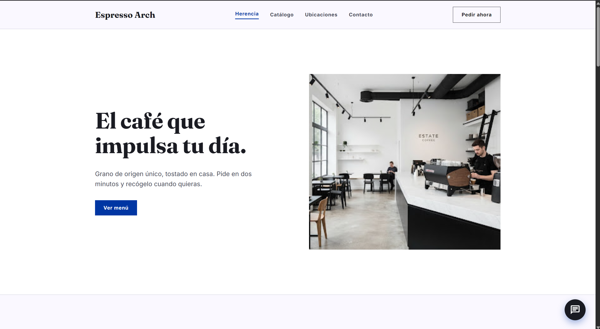

# ☕ Espresso Arch

Landing page para Espresso Arch, una cafetería de especialidad que recién está entrando al mercado de San Isidro, Lima. El sitio busca comunicar en pocos segundos qué la diferencia: café de origen único, tueste propio y un espacio pensado tanto para trabajar como para socializar.



---

## 🛠️ Tecnologías


---

## ✨ Características

- **Hero con llamado a la acción directo** — mensaje claro sobre la propuesta de valor y botón para ver el menú.
- **Sección de marca ("Nuestra Herencia")** — comunica el enfoque en calidad de grano y comunidad.
- **Catálogo de productos destacados** — tarjetas con precio, origen y descripción de cada ítem.
- **Ubicación con mapa embebido** — dirección, horarios y enlace directo a Google Maps.
- **Slider de testimonios** — opiniones de clientes con navegación manual e indicadores.
- **Formulario de contacto funcional** — integrado con Formspree, sin necesidad de backend propio.
- **Botón flotante de WhatsApp** — contacto directo para pedidos o consultas rápidas.
- **Animaciones al hacer scroll** — transiciones sutiles con IntersectionObserver, sin librerías externas.
- **Diseño responsive** — adaptado a mobile, tablet y desktop.
- **Rendimiento optimizado** — 100/100 en PageSpeed Insights.

---

## 🚀 Demo

El sitio está desplegado en Vercel:

**[https://cafeteria-eight-theta.vercel.app/](https://cafeteria-eight-theta.vercel.app/)**

---

## 💻 Cómo ejecutar localmente

Este proyecto no requiere build ni instalación de dependencias, ya que Tailwind se carga vía CDN.

```bash
# 1. Clona el repositorio
git clone https://github.com/tu-usuario/espresso-arch.git

# 2. Entra a la carpeta del proyecto
cd espresso-arch

# 3. Abre el archivo index.html en tu navegador
# (puedes simplemente hacer doble clic, o usar una extensión como Live Server en VS Code)
```

Si prefieres levantar un servidor local rápido con Python:

```bash
python3 -m http.server 8000
```

Luego abre `http://localhost:8000` en tu navegador.

---

## 📄 Licencia

Este proyecto es de uso personal/comercial para Espresso Arch. Si quieres adaptarlo para tu propio negocio, siéntete libre de usarlo como referencia.
